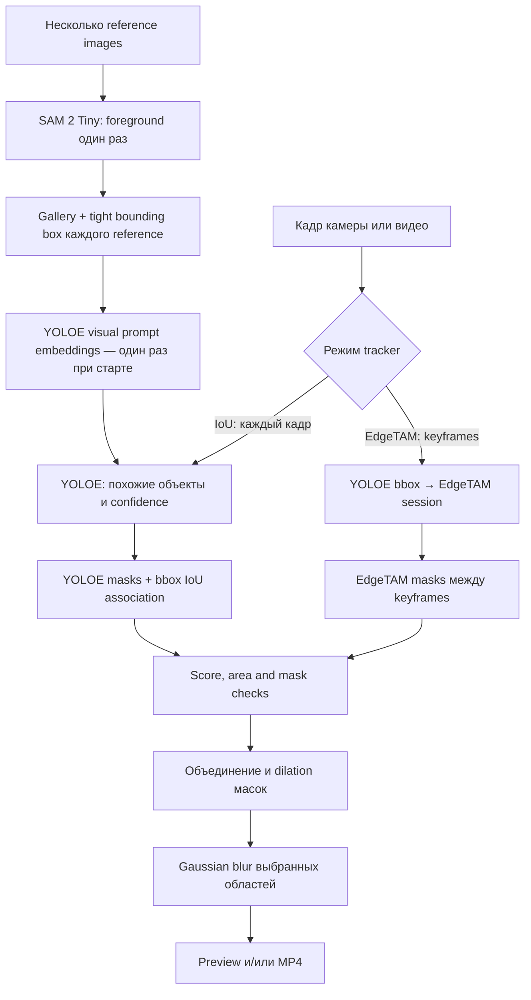

# Personalized real-time privacy filter

Real-time фильтр для камеры: зарегистрированный владелец остаётся видимым, остальные обнаруженные лица скрываются пикселизацией.

Проект использует YOLO11n-face, опциональную YOLO11n-face-pose с пятью лендмарками, официальные трекеры Ultralytics, выбираемую IResNet recognition-модель, ONNX Runtime и OpenCV. На Apple Silicon автоматически используется CoreML. На Windows автоматически используется DirectML с совместимой NVIDIA, AMD или Intel GPU, а при недоступности GPU — CPU.

## Клонирование

```bash
git clone https://github.com/korosaii/Personalized-real-time-privacy-filter.git
cd Personalized-real-time-privacy-filter
```

## Установка

Создайте окружение на любой операционной системе:

```bash
python -m venv .venv
```

macOS:

```bash
source .venv/bin/activate
```

Windows:

```powershell
.venv\Scripts\Activate.ps1
```

Установите проект:

```bash
python -m pip install --upgrade pip setuptools
python -m pip install -r requirements.txt
```

`requirements.txt` устанавливает все runtime-режимы. Если нужен только один
набор зависимостей, используйте editable extras:

| Режим | Команда установки |
|---|---|
| Только face detection/tracking/recognition | `python -m pip install -e .` |
| Face + виртуальная веб-камера | `python -m pip install -e ".[virtual-camera]"` |
| Face + offline text-prompt | `python -m pip install -e ".[grounded-video]"` |
| Face + realtime image-prompt | `python -m pip install -e ".[image-prompt]"` |
| Все режимы | `python -m pip install -r requirements.txt` |

На Windows пакет DirectML устанавливается автоматически. Выбирать модель видеокарты или provider вручную не нужно.

Разрешите доступ к камере для Terminal или VS Code в настройках приватности операционной системы.

## Модели

```text
models/
├── detector/
│   ├── yolov11n-face.onnx
│   ├── yolov11n-face-pose.onnx
│   └── yolov11n-face-pose-roll90.onnx
├── recognition/
│   ├── iresnet_r34_glint360k.onnx
│   ├── iresnet_r100_glint360k.onnx
│   └── webface_r50.onnx
├── yoloe/
│   └── yoloe-26n-seg.pt
└── edgetam/
    └── EdgeTAM-hf/
        ├── model.safetensors
        ├── config.json
        └── preprocessor_config.json
```

Runtime использует статический YOLO11 ONNX с входом `640×640` и выбранную recognition-модель с входом `112×112`. Детектор `yolo11` и recognition-модель `r34-glint360k` используются по умолчанию. Детекторы `yolo11-pose` и `yolo11-pose-roll90` выдают bbox и пять точек лица за один inference. Вариант `yolo11-pose-roll90` дообучен на WIDER FACE и WFLW с поворотами до ±90°.

Доступные имена моделей: `r34-glint360k`, `r100-glint360k`, `r50-webface600k`. Официальной R100@WebFace600K в InsightFace Model Zoo нет; для R100 используется Glint360K.

## Режимы и пайплайны

| Пайплайн | Источник | Что скрывает | Основной запуск |
|---|---|---|---|
| Face privacy webcam | Камера | Все лица, кроме подтверждённых владельцев | `privacy-recognize` |
| Face privacy realtime-video | Видеофайл | То же, с теми же detector/tracker/recognition | `privacy-recognize --realtime-video ...` |
| Offline text-prompt | Видеофайл | Объекты, заданные текстом | `privacy-recognize --offline-video ...` |
| Realtime image-prompt | Камера или видео | Объекты, заданные reference-изображениями | `privacy-recognize --image-prompt-video ...` |

Флаги `--offline-video`, `--realtime-video` и `--image-prompt-video`
взаимоисключающие. Без них запускается face privacy для веб-камеры.


## Регистрация владельца

Создайте внутри `data/photos` отдельный каталог для каждого владельца и добавьте
в него одну или несколько фотографий:

```text
data/photos/owner/
data/photos/alice/
data/photos/bob/
```

При обычном запуске камеры и в режиме `--realtime-video` templates всех
непустых каталогов автоматически пересобираются в `data/enrollments/` и сразу
загружаются. Отдельно запускать `privacy-enroll` больше не нужно:

```bash
privacy-recognize
```

Detector, recognition model и `--rotations` для автоматической регистрации
берутся из параметров текущего запуска, поэтому template всегда совместим с
realtime-пайплайном. Другую папку можно указать через
`--owners-photos-dir PATH`, а каталог для templates — через
`--enrollments-dir PATH`.

Ручная регистрация по-прежнему доступна:

```bash
privacy-enroll owner data/photos/owner
```

Для регистрации с выравниванием по глазам, носу и углам рта создайте отдельный template:

```bash
privacy-enroll owner data/photos/owner --detector yolo11-pose --output data/enrollments/owner-pose.npz
```

Для честного сравнения экспериментального detector, дообученного на больших наклонах, создайте отдельный template:

```bash
privacy-enroll owner data/photos/owner --detector yolo11-pose-roll90 --output data/enrollments/owner-pose-roll90.npz
```

Для сравнения моделей создавайте отдельный template для каждой:

```bash
privacy-enroll owner data/photos/owner --model r34-glint360k --output data/enrollments/owner-r34.npz
privacy-enroll owner data/photos/owner --model r100-glint360k --output data/enrollments/owner-r100.npz
privacy-enroll owner data/photos/owner --model r50-webface600k --output data/enrollments/owner-r50-w600k.npz
```

По умолчанию каждая фотография даёт один обычный embedding. Для теста с поворотами создайте отдельный template:

```bash
privacy-enroll owner data/photos/owner --model r100-glint360k --rotations --output data/enrollments/owner-r100-rot.npz
privacy-enroll owner data/photos/owner --model r50-webface600k --rotations --output data/enrollments/owner-r50-w600k-rot.npz
```

Biometric template сохраняется в `data/enrollments/owner.npz`. Исходные фотографии и enrollment data исключены из Git.

Флаги ручного `privacy-enroll`:

| Аргумент / флаг | По умолчанию | Назначение |
|---|---:|---|
| `name` | обязательный | Локальное имя владельца. |
| `photos` | обязательный | Один или несколько файлов/каталогов. |
| `--output` | `data/enrollments/<name>.npz` | Выходной template. |
| `--detector-model`, `--detector` | `yolo11` | Detector alias или ONNX. |
| `--recognition-model`, `--model` | `r34-glint360k` | Recognition alias или ONNX. |
| `--provider` | `auto` | ONNX Runtime provider. |
| `--threshold` | `0.35` | Порог, сохраняемый в template. |
| `--rotations` | выключен | Добавить embeddings поворотов к upright embedding. |
| `--min-face-size` | `80` | Минимальная сторона обнаруженного лица. |
| `--min-sharpness` | `25` | Минимальная резкость face crop. |

### Несколько владельцев

По умолчанию достаточно разложить фотографии по каталогам
`data/photos/alice`, `data/photos/bob` и запустить `privacy-recognize`: оба
владельца будут зарегистрированы и загружены автоматически.

Для ручного управления каждый владелец регистрируется в отдельный template теми
же detector и recognition model:

```bash
privacy-enroll alice data/photos/alice --detector yolo11-pose-roll90 --model r50-webface600k --output data/enrollments/alice.npz
privacy-enroll bob data/photos/bob --detector yolo11-pose-roll90 --model r50-webface600k --output data/enrollments/bob.npz
```

При ручном запуске повторите `--template`:

```bash
privacy-recognize --detector yolo11-pose-roll90 --model r50-webface600k --template data/enrollments/alice.npz --template data/enrollments/bob.npz
```

Наличие хотя бы одного `--template` отключает автоматическую регистрацию для
этого запуска. Флаг `--no-auto-enroll` также оставляет старое поведение с
`data/enrollments/owner.npz`.

Можно передать отдельный каталог: все `.npz` непосредственно из него будут
загружены как владельцы. Например, положите только семейные templates в
`data/enrollments/family/` и передайте `--template data/enrollments/family`.
Имена внутри template должны быть уникальны. Все файлы в таком каталоге должны
быть созданы одной recognition model, с одинаковыми detector preprocessing и
режимом `--rotations`. Не передавайте общий каталог, если в нём смешаны
templates разных моделей или detector mode. Совпадение ищется по всем
владельцам; три подтверждения разных людей не объединяются в одну авторизацию.

Без `--rotations` embeddings обычных фотографий усредняются в один L2-normalized centroid. С `--rotations` для каждого фото создаются шесть embedding для `0°`, `30°`, `90°`, `180°`, `270°` и `330°`, затем строится шесть centroid. Runtime берёт максимальное сходство по активным centroid.

Порог авторизации по умолчанию: `0.35`.

## Запуск

```bash
privacy-recognize
```

При автоматической регистрации достаточно выбрать Pose-детектор — templates из
`data/photos` будут созданы с тем же detector mode:

```bash
privacy-recognize --detector yolo11-pose
```

Для запуска с заранее созданным ручным template укажите его явно:

```bash
privacy-recognize --detector yolo11-pose --template data/enrollments/owner-pose.npz
```

Запуск экспериментального варианта с большими наклонами:

```bash
privacy-recognize --detector yolo11-pose-roll90 --template data/enrollments/owner-pose-roll90.npz
```

Минимальный размер bbox, при котором лицо может проверяться как владелец,
задаётся флагом `--minimum-owner-face-size` (по умолчанию `80` px):

```bash
privacy-recognize --minimum-owner-face-size 70
```

Пока recognition не выполнен, система ещё не знает личность, поэтому этот gate
применяется ко всем кандидатам. Лица меньше порога остаются скрытыми. Отдельный
`--minimum-authorized-face-size` управляет минимальным размером уже
авторизованного и уверенно отслеживаемого владельца.

В этом режиме перед recognition лицо геометрически приводится к ArcFace `112×112` по пяти точкам. Выравнивание исправляет положение, масштаб и наклон головы в плоскости изображения. Оно не выполняет 3D-фронтализацию сильного профиля.

По умолчанию используется официальный Ultralytics ByteTrack. Доступны три режима:

```bash
privacy-recognize --tracker bytetrack
privacy-recognize --tracker botsort
privacy-recognize --tracker iou
```

`bytetrack` и `botsort` используют реализацию из пакета Ultralytics. `iou` оставлен как лёгкий локальный baseline. BoT-SORT работает без дополнительной ReID-модели. При потере или неуверенном продолжении трека состояние `AUTHORIZED` сбрасывается, и лицо снова скрывается до recognition.

Для ByteTrack и BoT-SORT detector threshold автоматически равен `0.10`, чтобы официальный трекер получал как уверенные, так и слабые detections. Для локального IoU baseline автоматически используется `0.25`. Явное значение можно передать через `--detector-threshold`.

Запуск конкретной модели с её template:

```bash
privacy-recognize --model r34-glint360k --template data/enrollments/owner-r34.npz
privacy-recognize --model r100-glint360k --template data/enrollments/owner-r100.npz
privacy-recognize --model r50-webface600k --template data/enrollments/owner-r50-w600k.npz
```

Для template, созданного с поворотами, добавьте тот же флаг:

```bash
privacy-recognize --model r100-glint360k --rotations --template data/enrollments/owner-r100-rot.npz
privacy-recognize --model r50-webface600k --rotations --template data/enrollments/owner-r50-w600k-rot.npz
```

Изображение камеры зеркалится по умолчанию. Для обычного незеркального отображения:

```bash
privacy-recognize --no-mirror
```

Лица с bbox меньше `80 px` остаются скрытыми и не отправляются в recognition. Перед первой проверкой лицо должно полностью находиться внутри кадра, а трек — быть стабильным три кадра. Новый подходящий трек проходит три проверки. После авторизации стабильный трек сохраняет состояние без постоянного recognition, в том числе при частичном выходе за край кадра. UNKNOWN повторно проверяется через `30`, `60`, `120`, `240` и затем каждые `300` кадров. Новый или неуверенный трек проверяется сразу. Авторизация сохраняется при уменьшении лица до `56 px`.

Неавторизованное лицо пикселизируется внутри овала, вписанного непосредственно
в bbox. Bbox не расширяется, а его углы остаются без пикселизации.

Освещение оценивается по padding-кольцу размером 25% вокруг bbox без пикселей
самого лица и по сохранности информации внутри face crop. Метрики сглаживаются
по треку. Используются режимы `NORMAL`, `LOW_LIGHT` и `OVEREXPOSED` (засвет).
По умолчанию предполагается, что при enrollment не было тёмных или засвеченных
фотографий: в двух ухудшенных режимах порог повышается на `0.10`, а пограничные
совпадения остаются `UNKNOWN`. Если такие фотографии были добавлены при
enrollment, запускайте распознавание с флагом:

```bash
privacy-recognize --enrollment-has-difficult-lighting
```

Тогда в `LOW_LIGHT` и `OVEREXPOSED` используется тот же порог, что и в
`NORMAL`. Величину повышения без флага можно изменить через
`--difficult-lighting-threshold-increase`.
При ухудшении освещения авторизованный трек сразу скрывается и проходит
повторную проверку. Количество лиц в каждом режиме показывается в верхнем
оверлее; показатели освещения рядом с bbox не выводятся.

Завершение: `Q`, `Esc` или `Ctrl+C`. Последний benchmark сохраняется локально в `benchmarks/latest.json`.

## Виртуальная веб-камера

Флаг `--virtual-camera` публикует уже обработанные кадры как отдельную веб-камеру.
Исходное неотредактированное изображение в виртуальное устройство не передаётся:
до готовности первого результата выводится чёрный кадр, а между результатами
повторяется последний обработанный кадр. Preview и запись MP4 можно включать или
выключать независимо.

При установке через `requirements.txt` поддержка уже включена. Для минимальной
face-only установки добавьте extra отдельно:

```powershell
python -m pip install -e ".[virtual-camera]"
```

На Windows сначала установите OBS Studio: `pyvirtualcam` использует установленное
устройство **OBS Virtual Camera**. Запускать виртуальную камеру кнопкой OBS не
нужно; OBS лучше закрыть, чтобы устройство не было занято. Если устройство не
появилось, установите его по официальной инструкции OBS и перезапустите приложение,
в котором будете выбирать камеру.

Face privacy как виртуальная веб-камера:

```powershell
privacy-recognize --virtual-camera --no-preview
```

Image-prompt pipeline как виртуальная веб-камера:

```powershell
privacy-recognize --image-prompt-video `
  --reference-image data/references/object.jpg `
  --virtual-camera `
  --no-preview
```

После запуска выберите **OBS Virtual Camera** в Zoom, Discord, браузере или другой
программе. Разрешение виртуальной камеры совпадает с фактическим разрешением
источника; для веб-камеры оно запрашивается через `--width` и `--height`. FPS
берётся из источника, а если backend его не сообщает — из `--camera-fps`.

Можно одновременно сохранить результат:

```powershell
privacy-recognize --virtual-camera `
  --video-output data/videos/webcam.redacted.mp4 `
  --no-preview
```

Флаг работает с face privacy, `--realtime-video` и `--image-prompt-video`. Offline
text-prompt pipeline не является realtime и с `--virtual-camera` не запускается.

Дополнительные параметры:

```bash
privacy-recognize --help
privacy-enroll --help
inspect-models --help
```

### Флаги face privacy: webcam и realtime-video

Флаги регистрации и моделей:

| Флаг | По умолчанию | Назначение |
|---|---:|---|
| `--template PATH` | автоматическая регистрация | Готовый `.npz` или каталог templates; можно повторять. Наличие флага отключает auto-enroll. |
| `--owners-photos-dir`, `--photos-dir` | `data/photos` | Каталог с подпапками владельцев. |
| `--auto-enroll` / `--no-auto-enroll` | включён | Пересобрать templates из фотографий при старте или использовать готовый `owner.npz`. |
| `--enrollments-dir` | `data/enrollments` | Каталог автоматически созданных templates. |
| `--enrollment-min-face-size` | `80` | Минимальная сторона лица на фотографии регистрации. |
| `--enrollment-min-sharpness` | `25` | Минимальная резкость фотографии регистрации. |
| `--detector-model`, `--detector` | `yolo11` | Алиас `yolo11`, `yolo11-pose`, `yolo11-pose-roll90` или путь к ONNX. |
| `--recognition-model`, `--model` | `r34-glint360k` | Алиас recognition-модели или путь к ONNX. |
| `--provider` | `auto` | `auto`, `cpu`, `coreml`, `directml` или `cuda`. |
| `--threshold` | из template (`0.35` для auto-enroll) | Общий override порога авторизации. |
| `--rotations` | выключен | Создавать/использовать centroids для `0/30/90/180/270/330°`. |

Флаги распознавания, трекинга и privacy policy:

| Флаг | По умолчанию | Назначение |
|---|---:|---|
| `--tracker` | `bytetrack` | `bytetrack`, `botsort` или локальный `iou`. |
| `--detector-threshold` | `0.10` Ultralytics / `0.25` IoU | Явный confidence threshold detector. |
| `--tracker-buffer` | `30` | Буфер ByteTrack/BoT-SORT. |
| `--track-iou-threshold` | `0.25` | Ассоциация локального IoU tracker. |
| `--authorization-iou-threshold` | `0.40` | Минимальный IoU уверенного продолжения авторизованного track. |
| `--track-max-missed` | `8` | Пропуски до удаления runtime-состояния track. |
| `--minimum-owner-face-size`, `--minimum-recognition-face-size` | `80` | Минимальная сторона bbox для попытки recognition. |
| `--minimum-authorized-face-size` | `56` | Минимальный bbox для сохранения уже авторизованного лица видимым. |
| `--recognition-stable-frames` | `3` | Стабильные кадры перед первой проверкой. |
| `--recognition-edge-margin` | `0.05` | Запрет первой проверки возле края кадра. |
| `--confirmations` | `3` | Последовательные совпадения с одним владельцем до reveal. |
| `--unknown-retry-interval` | `30` | Начало exponential backoff повторных проверок UNKNOWN. |
| `--authorized-recheck-interval` | `0` | Периодическая проверка AUTHORIZED; `0` отключает. |
| `--lighting-padding` | `0.25` | Размер ambient-light ring вокруг bbox. |
| `--lighting-ema-alpha` | `0.20` | Вес текущего измерения освещения в EMA. |
| `--enrollment-has-difficult-lighting` | выключен | Не повышать threshold в LOW_LIGHT/OVEREXPOSED. |
| `--difficult-lighting-threshold-increase` | `0.10` | Повышение threshold при сложном освещении. |

Флаги источника, preview, записи и диагностики:

| Флаг | По умолчанию | Назначение |
|---|---:|---|
| `--camera` | `0` | Индекс веб-камеры. |
| `--width`, `--height` | `1280`, `720` | Запрашиваемое разрешение камеры. |
| `--camera-fps` | `30` | Запрашиваемый FPS камеры. |
| `--realtime-video` | выключен | Взять кадры из `--video-path` вместо камеры. |
| `--video-path` | — | Входное видео; обязательно для realtime-video. |
| `--video-output` | — | Путь MP4; обязателен для realtime-video, опционален для камеры. |
| `--video-output-size` | исходный размер | Финальный `WIDTHxHEIGHT`; не меняет model input. |
| `--mirror` / `--no-mirror` | камера: on, файл: off | Отражение входных кадров. |
| `--preview` / `--no-preview` | включён | Окно с обработанным потоком. |
| `--virtual-camera` | выключен | Публиковать обработанный поток как виртуальную веб-камеру. |
| `--max-frames` | `0` | Лимит кадров; `0` означает без ограничения. |
| `--benchmark-out` | `benchmarks/latest.json` | JSON runtime-метрик и настроек. |

## Offline-обработка видео через Grounding DINO + SAM 2.1

По умолчанию offline-режим использует публичные веса
`IDEA-Research/grounding-dino-tiny` и `facebook/sam2.1-hiera-small`. Grounding
DINO находит объекты по тексту, а SAM 2.1 сегментирует их и отслеживает между
повторными детекциями:

```powershell
privacy-recognize --offline-video `
  --video-path data/videos/input.mp4 `
  --video-prompt "face" `
  --video-prompt "license plate" `
  --video-output data/videos/input.redacted.mp4
```

Если `--video-output` не указан, результат сохраняется рядом с исходником как
`<имя>.redacted.mp4`. Веса обеих моделей загружаются из Hugging Face
автоматически и не требуют заявки или токена. Все необходимые пакеты
устанавливаются общей командой:

```powershell
python -m pip install -r requirements.txt
```

PyTorch устанавливайте отдельно со сборкой под имеющуюся CUDA. Без CUDA режим
тоже запускается, но будет очень медленным. По умолчанию DINO повторно ищет
объекты каждые 25 кадров; интервал меняется через
`--grounding-redetect-interval`. Пороги задаются параметрами
`--grounding-box-threshold` и `--grounding-text-threshold`.
Интервал одновременно является размером потокового SAM 2.1 чанка: в памяти
находятся только эти кадры, а не всё видео. Устройство выбирается автоматически;
его можно зафиксировать через `--offline-device cpu` или
`--offline-device cuda`.
Для инференса 4K-кадры по умолчанию уменьшаются до 1280 px по длинной стороне,
после чего маска возвращается в исходное разрешение. Размер меняется через
`--video-inference-max-side`; значение `0` отключает уменьшение.
Для короткого пробного запуска можно ограничить обработку, например
`--max-frames 30`. Чтобы изменить разрешение готового файла, укажите, например,
`--video-output-size 1920x1080`. Маски при этом масштабируются вместе с кадрами,
а исходное видео не изменяется.

Параметр `--video-prompt` можно повторить несколько раз. Все классы передаются
Grounding DINO одновременно, а маски объединяются перед пикселизацией. Выходной
MP4 пока создаётся без аудиодорожки. Если SAM 2.1 не вернул маску для ожидаемого
кадра, такой кадр полностью пикселизируется.

Основные флаги offline text-prompt pipeline:

| Флаг | По умолчанию | Назначение |
|---|---:|---|
| `--offline-video` | обязательный mode flag | Включить Grounding DINO + SAM 2.1. |
| `--video-path` | обязательный | Входной видеофайл. |
| `--video-prompt TEXT` | обязательный | Текстовый класс; можно повторять для объединения масок. |
| `--video-output` | `<source>.redacted.mp4` | Путь выходного MP4. |
| `--video-output-size` | исходный размер | Финальный `WIDTHxHEIGHT`. |
| `--offline-device` | `auto` | `auto`, `cpu` или `cuda`. |
| `--grounding-model` | `IDEA-Research/grounding-dino-tiny` | Hugging Face ID Grounding DINO. |
| `--grounding-box-threshold` | `0.20` | Порог bbox Grounding DINO. |
| `--grounding-text-threshold` | `0.20` | Порог соответствия тексту. |
| `--grounding-redetect-interval` | `25` | Размер streaming-чанка и период DINO keyframe. |
| `--video-inference-max-side` | `1280` | Максимальная длинная сторона model input; `0` оставляет source size. |
| `--sam2-model` | `facebook/sam2.1-hiera-small` | Hugging Face ID SAM 2.1. |
| `--sam2-checkpoint` | — | Локальный SAM 2.1 checkpoint вместо Hub model. |
| `--sam2-model-config` | `configs/sam2.1/sam2.1_hiera_s.yaml` | Конфиг локального checkpoint. |
| `--video-pixel-block-size` | `16` | Размер блока пикселизации масок. |
| `--max-frames` | `0` | Лимит кадров для smoke test. |

## Realtime-сегментация по изображениям: YOLOE + IoU/EdgeTAM

Отдельный `--image-prompt-video` режим ищет не текстовый класс, а объекты,
похожие на загруженные изображения. По умолчанию SAM 2 Tiny один раз при старте
автоматически выделяет центральный foreground каждого reference. YOLOE получает
два prompt-варианта с общим class ID: natural tight crop с небольшим контекстом
и masked crop на нейтральном фоне. В realtime цикле reference SAM не работает и
на FPS не влияет. Один каталог считается одним объектом, а файлы внутри него —
его ракурсами. Повторные `--reference-image` создают отдельные object classes.

Обработка файла:

```powershell
privacy-recognize --image-prompt-video `
  --video-path data/videos/input.mp4 `
  --video-output data/videos/input.objects-redacted.mp4 `
  --reference-image data/references/backpack `
  --no-preview
```

Если нужно скрывать два разных объекта, повторите флаг с двумя путями. Чтобы
объединить несколько ракурсов одного объекта в один class ID, положите их в
один каталог и передайте этот каталог одним `--reference-image`.

Обработка веб-камеры:

```powershell
privacy-recognize --image-prompt-video `
  --reference-image data/references/objects `
  --video-output data/videos/camera.objects-redacted.mp4
```

Пайплайн работает так:



YOLOE извлекает visual embeddings из общей gallery один раз при запуске. В
режиме `iou` YOLOE-seg запускается на каждом кадре, а bbox связываются с
предыдущими по IoU; EdgeTAM не загружается. В режиме `edgetam` YOLOE ищет
объекты только на keyframes, а EdgeTAM переносит маски между ними.
Natural и masked варианты одного ракурса, а также все изображения внутри одного
reference-каталога используют одинаковый class ID. Class-agnostic NMS и
дополнительная проверка overlap-over-smaller-box оставляют из вложенных или
пересекающихся дубликатов только bbox с наибольшей confidence.

Флаг `--image-yolo-onnx` после извлечения visual embeddings экспортирует модель
в FP32 ONNX с фиксированными prompts. Результат кэшируется в
`models/yoloe/onnx/` по содержимому checkpoint и reference gallery. Повторный
запуск использует готовый ONNX; изменение референсов создаёт новый файл. Такой
ONNX не принимает новые visual prompts во время inference — для нового объекта
нужен новый export/cache entry.

Полностью автоматический выбор предполагает, что нужный объект находится ближе
к центру reference и занимает от 1% до 98% кадра. Маски стены и фона штрафуются
за контакт с границами. Для уже подготовленных PNG/crop без фона можно отключить
этот этап через `--no-image-reference-sam`. Значение
`--image-reference-sam-points` определяет плотность автоматического поиска:
стоимость растёт квадратично; `8` — быстрый старт, `12–16` полезны для маленьких
объектов. После обработки модель SAM выгружается до загрузки YOLOE.

Устройство определяется автоматически: сначала CUDA, затем Apple MPS, затем
CPU. Автоматическая точность — BF16 на совместимой CUDA, иначе FP16 на GPU и
FP32 на CPU. Выбор можно зафиксировать флагами `--image-device` и
`--image-precision`. PyTorch должен быть установлен в сборке под вашу CUDA;
DirectML, используемый ONNX-моделями face pipeline, не является CUDA backend
для EdgeTAM. `--image-tracker auto` выбирает `iou` на CPU и `edgetam` на
CUDA/MPS.

Модели этого режима хранятся внутри проекта. YOLOE загружается из
`models/yoloe/yoloe-26n-seg.pt`. Transformers snapshot EdgeTAM при первом
запуске режима `edgetam` скачивается в `models/edgetam/EdgeTAM-hf/`. В режиме
`iou` Transformers-модель EdgeTAM вообще не загружается.

Основные параметры качества и скорости:

| Флаг | По умолчанию | Назначение |
|---|---:|---|
| `--reference-image PATH` | обязательный | Папка объединяет ракурсы одного объекта; повторные пути создают отдельные классы. |
| `--image-yolo-model` | `models/yoloe/yoloe-26n-seg.pt` | Веса YOLOE visual-prompt segmentation. |
| `--image-yolo-onnx` / `--no-image-yolo-onnx` | выключен | Создать/использовать reference-specific FP32 ONNX с фиксированными visual prompts. |
| `--image-reference-sam` / `--no-image-reference-sam` | включён | Одноразово удалить фон reference через SAM 2 или использовать изображения как есть. |
| `--image-reference-sam-model` | `facebook/sam2.1-hiera-tiny` | Лёгкая SAM 2 модель только для preprocessing референсов. |
| `--image-reference-sam-points` | `8` | Сторона сетки automatic mask generation; число prompts растёт как квадрат значения. |
| `--image-reference-sam-min-area-ratio` | `0.01` | Минимальная доля reference, занимаемая выбранной маской. |
| `--image-reference-sam-max-area-ratio` | `0.98` | Максимальная доля reference, занимаемая выбранной маской. |
| `--image-edgetam-model` | `yonigozlan/EdgeTAM-hf` | Transformers-совместимый Hugging Face ID или локальный каталог EdgeTAM. |
| `--image-tracker` | `auto` | `auto`, тяжёлый `edgetam` или лёгкое сопоставление `iou`. |
| `--no-image-tracker` | — | Синоним `--image-tracker iou`: отключает EdgeTAM. |
| `--image-iou-threshold` | `0.30` | Минимальный IoU bbox для сохранения track ID. |
| `--image-iou-max-missed` | `1` | Сколько пропущенных кадров держать последнюю YOLOE-маску. |
| `--image-device` | `auto` | `auto`, `cuda`, `mps` или `cpu`. |
| `--image-precision` | `auto` | `auto`, `bf16`, `fp16` или `fp32`. |
| `--image-yolo-confidence` | `0.10` | Минимальная confidence YOLOE. Ниже — больше recall и ложных срабатываний. |
| `--image-yolo-iou` | `0.50` | IoU threshold для NMS YOLOE. |
| `--image-edgetam-score-threshold` | `0.50` | Минимальная sigmoid-оценка присутствия объекта EdgeTAM. |
| `--image-mask-threshold` | `0.0` | Порог mask logits; `0.0` соответствует вероятности `0.5`. |
| `--image-min-mask-area` | `64` | Отбрасывает слишком маленькие маски в пикселях. |
| `--image-max-mask-area-ratio` | `0.98` | Отбрасывает ошибочную маску, занимающую более 98% кадра. |
| `--image-redetect-interval` | `5` | Частота YOLOE только в режиме EdgeTAM; в IoU-режиме YOLOE работает каждый кадр. |
| `--image-max-objects` | `20` | Максимум одновременно передаваемых EdgeTAM объектов. |
| `--image-yolo-imgsz` | `640` | Разрешение YOLOE; меньше ускоряет поиск, но ухудшает мелкие объекты. |
| `--image-yolo-reference-imgsz` | `640` | Вход YOLOE при однократном извлечении visual embeddings из gallery. |
| `--image-edgetam-imgsz` | `1024` | Квадратный вход EdgeTAM; `256–1024`, кратно `64`. |
| `--image-reference-size` | `1280` | Размер исходного canvas gallery до YOLOE preprocessing. |
| `--image-mask-dilation` | `5` | Запас маски вокруг границы объекта в пикселях. |
| `--image-fallback-frames` | `3` | Сколько кадров держать последнюю маску при кратком пропадании трека. |
| `--image-redaction` | `blur` | Эффект скрытия: настоящий Gaussian `blur` или `pixelate`. |
| `--image-blur-kernel-size` | `51` | Размер ядра Gaussian blur; больше — сильнее размытие. |
| `--image-pixel-block-size` | `16` | Размер блока только для режима `--image-redaction pixelate`. |
| `--image-fail-closed` / `--no-image-fail-closed` | включён | При ошибке инференса скрывать весь кадр или остановить обработку. |
| `--image-diagnostic-overlay` / `--no-image-diagnostic-overlay` | включён | Показывать FPS, track ID, reference, YOLOE confidence и EdgeTAM score/IoU. |

Если bottleneck находится в YOLOE, увеличивайте `--image-redetect-interval` до
`8–15` и уменьшайте `--image-yolo-imgsz` до `512` или `416`. Если, как в
текущем CPU benchmark, основное время занимает EdgeTAM, уменьшайте
`--image-edgetam-imgsz`: redetect interval его latency не меняет.
На CPU режим функционален, но EdgeTAM с входом 1024 px может не обеспечивать
realtime. Для оценки реальной системы используйте JSON из `--benchmark-out`:
в нём отдельно записаны latency YOLOE на keyframes, EdgeTAM и всего кадра.
Выходной MP4, как и в других режимах, создаётся без аудиодорожки.
Общие флаги источника и вывода (`--video-path`, `--video-output`,
`--video-output-size`, `--camera`, `--width`, `--height`, `--camera-fps`,
`--mirror`, `--preview`, `--virtual-camera`, `--max-frames`, `--benchmark-out`) работают и в этом
режиме. Для входного видео `--video-output` обязателен; для камеры запись можно
не включать.

Диагностическая строка над объектом имеет вид
`id=1 ref=2 yolo=0.81 edge=0.93` либо `iou=0.74`. `id` — временный track ID, `ref` —
номер `--reference-image` в порядке загрузки, `yolo` — confidence последнего
YOLOE keyframe, `edge` — текущая sigmoid-оценка присутствия объекта. Между
keyframes значение `yolo` сохраняется от последней детекции. Верхняя строка
показывает скользящий FPS по 30 последним кадрам, полную latency кадра и
отдельные latency YOLOE/EdgeTAM. Overlay попадает и в preview, и в выходной MP4;
его можно отключить через `--no-image-diagnostic-overlay`.
Если EdgeTAM вернул маску почти на весь кадр, она не применяется, а в overlay
появляется `rejected-large-mask`. Предел регулируется через
`--image-max-mask-area-ratio`; значение `1.0` полностью отключает эту защиту.

### Рекомендуемые разрешения image-prompt моделей

Все три model-input флага задают квадратную сторону в пикселях. YOLOE-размеры
должны делиться на `32`, EdgeTAM — на `64`. При изменении EdgeTAM-разрешения код
согласованно перестраивает processor, FPN feature grids, prompt encoder и RoPE
memory attention; одного resize изображения для этой модели недостаточно.

| Оборудование / сценарий | YOLOE кадр | YOLOE references | EdgeTAM | Gallery |
|---|---:|---:|---:|---:|
| CPU, IoU максимум скорости | `416` | `512` | выключен | `1024` |
| CPU, IoU баланс | `512` | `640` | выключен | `1280` |
| GPU 4–6 GB | `640` | `640` | `768` | `1280` |
| GPU 8+ GB, баланс | `640` | `768` | `1024` | `1280` |
| Мелкие объекты / максимум качества | `960` | `960` | `1024` | `1920` |

Для текущего CPU-запуска начните так:

```powershell
privacy-recognize --image-prompt-video `
  --reference-image data/references/object.jpg `
  --image-yolo-onnx `
  --no-image-tracker `
  --image-yolo-imgsz 512 `
  --image-yolo-reference-imgsz 640 `
  --image-iou-threshold 0.30 `
  --image-iou-max-missed 1 `
  --image-reference-size 1280
```

`--image-yolo-reference-imgsz` влияет в основном на качество visual embedding и
время запуска: reference encoder выполняется один раз. `--image-yolo-imgsz`
влияет на каждый кадр IoU-режима и на каждый keyframe EdgeTAM-режима.
`--image-edgetam-imgsz` используется только при `--image-tracker edgetam`.
Checkpoint обучен на `1024×1024`, поэтому `512/640` заметно быстрее, но хуже
держит тонкие границы и маленькие объекты. Сравнивайте `latency_ms`, tracker и
input sizes в `benchmarks/latest.json`.

## Realtime-обработка и запись видео

Для обработки готового видео тем же face detection, tracking и recognition
pipeline, который используется для веб-камеры:

```powershell
privacy-recognize --realtime-video `
  --video-path data/videos/input.mp4 `
  --video-output data/videos/input.realtime-redacted.mp4 `
  --video-output-size 1920x1080 `
  --no-preview
```

В этом режиме текстовые prompts и сегментация не используются: детектируются
только лица. Владелец остаётся видимым, остальные лица пикселизируются внутри
овала. Все кадры обрабатываются последовательно, а итоговый файл сохраняется с
FPS исходного видео. Для короткой проверки можно добавить `--max-frames 30`.

Веб-камеру тоже можно записывать:

```powershell
privacy-recognize `
  --video-output data/videos/webcam.redacted.mp4 `
  --video-output-size 1920x1080
```

Без `--video-output` веб-камера только обрабатывается и показывается, запись не
ведётся. Флаг `--no-preview` отключает окно, но не обработку и не запись. В файл
попадают овальная пикселизация, подписи и верхний оверлей метрик. Для веб-камеры
кадры при необходимости дублируются, чтобы длительность записи соответствовала
реальному времени. Аудиодорожка пока не сохраняется.

## Тесты на датасете ChokePoint

Сырые кадры и XML-разметка ChokePoint не входят в Git. Скачайте датасет и
разложите нужную группу так, чтобы benchmark находил три камеры и ground truth:

```text
data/
├── P1E_S1/
│   ├── P1E_S1_C1/P1E_S1_C1/*.jpg
│   ├── P1E_S1_C2/P1E_S1_C2/*.jpg
│   └── P1E_S1_C3/P1E_S1_C3/*.jpg
└── groundtruth/
    └── groundtruth/
        ├── P1E_S1_C1.xml
        ├── P1E_S1_C2.xml
        └── P1E_S1_C3.xml
```

Допустим и один уровень каталогов без повторного `P1E_S1_C1`: скрипт ищет обе
структуры. Подробности протокола находятся в
[`benchmarks/README.md`](benchmarks/README.md), а интерпретация multi-owner
результата — в
[`benchmarks/chokepoint_multi_owner_report.md`](benchmarks/chokepoint_multi_owner_report.md).

### Benchmark 1: полное скрытие размеченных лиц

Проверяет detector и проектную овальную пикселизацию по координатам глаз из GT:

```powershell
python benchmarks\chokepoint_privacy_benchmark.py `
  --data-root data `
  --sequence P1E_S1 `
  --model models\detector\yolov11n-face.onnx `
  --provider auto
```

| Флаг | По умолчанию | Назначение |
|---|---:|---|
| `--data-root` | `data` | Корень кадров и `groundtruth`. |
| `--sequence` | `P1E_S1` | Группа камер `<sequence>_C*.xml`. |
| `--model` | `models/detector/yolov11n-face.onnx` | Detector ONNX. |
| `--provider` | `auto` | ONNX Runtime provider. |
| `--detector-threshold` | `0.25` | Confidence detector. |
| `--minimum-eye-distance` | `10` | Меньшие лица выводятся отдельно и не входят в grade. |
| `--minimum-zone-coverage` | `0` | Опциональный порог approximate face-zone; `0` проверяет точное закрытие глаз. |
| `--minimum-privacy-recall` | `0.99` | Минимальный privacy recall для PASS. |
| `--maximum-leak-streak` | `2` | Максимальная серия leak-кадров. |
| `--target-fps` | `30` | Бюджет p95 latency. |
| `--frame-step` | `1` | Проверять каждый N-й XML-кадр. |
| `--max-frames` | `0` | Ограничение smoke test; `0` — вся группа. |
| `--output-prefix` | `benchmarks/chokepoint_privacy` | Префикс JSON, CSV и failure montage. |
| `--failure-images` | `12` | Максимум кадров в montage. |

### Benchmark 2: несколько владельцев, cross-camera

Выполняет два независимых прохода: enroll C1 → test C2, затем enroll C2 → test
C1. XML используется только для выбора соответствующего лица и ожидаемого
person ID; embeddings и cosine scores считаются по исходным изображениям.

```powershell
python benchmarks\chokepoint_multi_owner_benchmark.py `
  --data-root data `
  --sequence P1E_S1 `
  --owners 0001,0003,0006 `
  --minimum-owner-face-size 80
```

| Флаг | По умолчанию | Назначение |
|---|---:|---|
| `--data-root` | `data` | Корень ChokePoint. |
| `--sequence` | `P1E_S1` | Группа из камер C1/C2. |
| `--owners` | `0001,0003,0006` | Список person ID владельцев через запятую. |
| `--enrollment-samples` | `5` | Кадры регистрации каждого владельца в каждом проходе. |
| `--threshold` | `0.35` | Фиксированный cosine threshold. |
| `--confirmations` | `3` | Последовательные совпадения одного ID до reveal. |
| `--minimum-owner-face-size` | `80` | Size gate recognition. |
| `--detector` | `yolo11-pose-roll90` | Detector alias или ONNX. |
| `--recognition-model` | `r50-webface600k` | Recognition alias или ONNX. |
| `--provider` | `auto` | ONNX Runtime provider. |
| `--detector-threshold` | `0.25` | Confidence detector. |
| `--target-fps` | `30` | Бюджет p95 latency. |
| `--output-prefix` | `benchmarks/chokepoint_multi_owner` | Префикс JSON/CSV. |
| `--enrollment-output` | `data/enrollments/chokepoint_multi_owner` | Templates двух проходов. |

Оба benchmark возвращают exit code `0`, только если выполнены все заданные
quality и performance checks. Exit code `1` при успешно завершённом тесте
означает, что хотя бы один критерий не достигнут, а не ошибку чтения датасета.

### Зафиксированные результаты полного P1E_S1

Тест выполнен на Windows через DirectML (`DmlExecutionProvider` + CPU fallback).

| Проверка | Результат | Статус |
|---|---:|---|
| Face privacy: обработано кадров | `6876` | dataset integrity PASS |
| Face privacy: размеченных лиц | `2908` | — |
| Face privacy recall / leak frames | `100%` / `0` | PASS |
| Face privacy pipeline p95 | `48.46 ms` (`≈22.12 FPS` по mean) | FAIL для 30 FPS |
| Multi-owner: eligible owner identification | `100%` (`179/179`) | PASS |
| Multi-owner: confirmed reveal от всех owner-кадров | `49.26%` | FAIL для цели 80% |
| Multi-owner: wrong owner / confirmed stranger auth | `0%` / `0%` | PASS |
| Multi-owner: stranger privacy recall | `99.95%` | PASS |
| Multi-owner face-active p95 | `144.56 ms` / `149.54 ms` | FAIL для 30 FPS |

Низкий общий owner reveal объясняется прежде всего size gate: `158/337`
owner-кадров имели bbox меньше `80 px`; начало каждой непрерывной серии также
скрыто до трёх подтверждений. Среди кадров, допущенных к recognition, правильный
владелец выбран во всех случаях. JSON/CSV являются локальными генерируемыми
артефактами и исключены из Git; в репозитории хранится воспроизводимый код и
сводный Markdown-отчёт.
