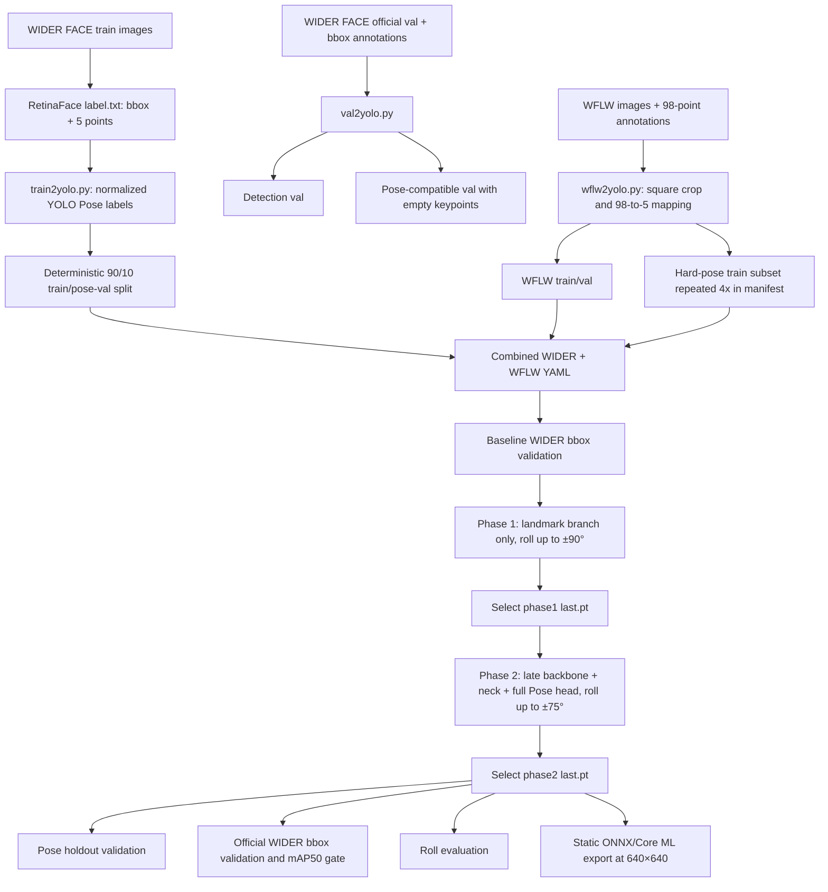
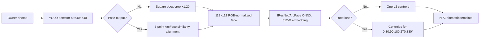
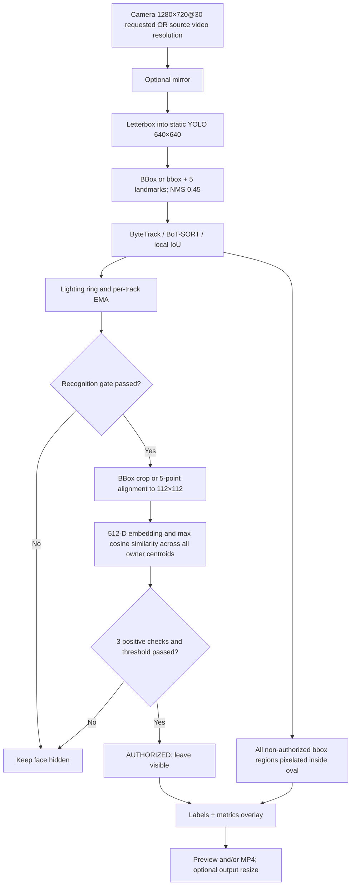
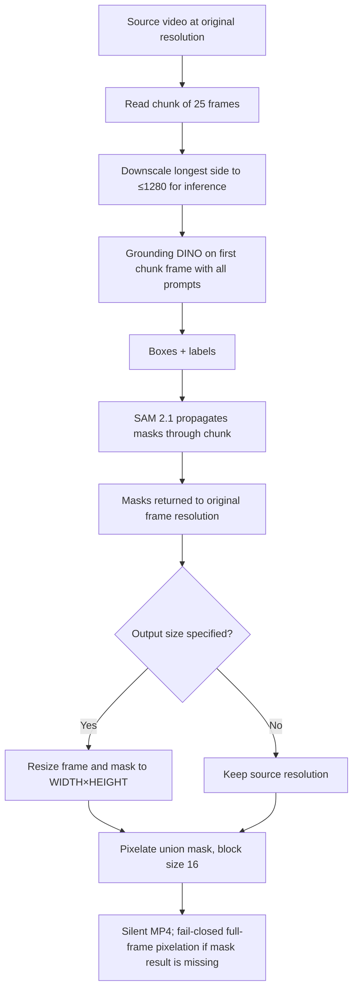

# Анализ обучения, трекеров и пайплайнов privacy-filter

## 1. Область анализа и достоверность

Документ составлен по фактическому коду `training/landmarks`, `privacy_filter`, корневому README и локальным файлам моделей.

Важно различать реализованный сценарий и доказанный факт запуска:

- в репозитории есть полный код подготовки данных, двухфазного обучения, оценки и экспорта;
- `training/landmarks/data`, `runs`, `artifacts`, файлы `*.pt` и `*.onnx` исключены из Git;
- локально присутствует экспорт `models/detector/yolov11n-face-pose-roll90.onnx` размером около 11 МБ;
- локально отсутствуют `training_summary.json`, `results.csv`, исходные `.pt` и roll-evaluation JSON.

Следовательно, можно точно описать алгоритм и параметры, которые задаёт код, но нельзя подтвердить фактические метрики, длительность, число реально пройденных эпох и точную команду конкретного завершённого обучения. README приводит рекомендуемые команды, а не журнал эксперимента.

Основные источники истины для этого отчёта:

| Область | Файлы |
|---|---|
| Подготовка данных | `training/landmarks/scripts/train2yolo.py`, `val2yolo.py`, `wflw2yolo.py`, `validate_dataset.py`, `dataset_common.py` |
| Обучение и архитектура | `training/landmarks/train.py`, `configs/yolo11n-face-pose.yaml`, `requirements.txt` |
| Оценка и экспорт | `scripts/evaluate_roll.py`, `evaluate_runtime_roll.py`, `export.py` |
| Детекция, alignment и recognition | `privacy_filter/yolo.py`, `recognition.py`, `enrollment.py`, `enroll_cli.py` |
| Трекинг и режимы запуска | `privacy_filter/tracking.py`, `recognize_webcam.py`, `grounded_sam2_video.py` |
| Разрешения и I/O | `privacy_filter/camera.py`, `yolo.py`, `recognition.py`, `grounded_sam2_video.py` |

## 2. Что обучалось

Обучается компактная одноклассовая `YOLO11n Pose`-модель с классом `face`. За один проход она выдаёт:

- bbox лица и confidence;
- пять точек: левый глаз, правый глаз, нос, левый и правый угол рта;
- confidence/visibility каждой точки.

Голова Pose работает на трёх масштабах признаков (слои 16, 19 и 22). Архитектура задаётся в `training/landmarks/configs/yolo11n-face-pose.yaml`: YOLO11n backbone/neck и стандартная Ultralytics `Pose`-голова с `kpt_shape: [5, 3]`.

Формат строки разметки содержит 20 значений:

```text
class cx cy width height x1 y1 v1 x2 y2 v2 x3 y3 v3 x4 y4 v4 x5 y5 v5
```

Координаты нормализованы. `v=2` означает видимую размеченную точку, `v=0` — отсутствующую. В YAML также задан `flip_idx: [1, 0, 2, 4, 3]`, чтобы при горизонтальном отражении корректно менять местами глаза и углы рта.

## 3. Данные и почему они выбраны

| Источник | Что даёт | Как используется | Почему нужен |
|---|---|---|---|
| WIDER FACE train + RetinaFace 5-point annotations | Много сцен, групповые, маленькие и удалённые лица, bbox и 5 точек | Детерминированный split 90/10 для Pose train/val | Сохраняет широкое качество face detection и даёт базовое обучение 5 точек |
| Официальный WIDER FACE val | Только bbox | Отдельная detection validation; для Pose создаются нулевые landmarks | Независимый контроль, что дообучение landmarks не испортило bbox |
| WFLW | 10 000 лиц, 98 ручных точек и атрибуты pose/expression/illumination/makeup/occlusion/blur | Каждое лицо вырезается в квадрат; 98 точек сводятся к 5; train/test становятся train/val | Добавляет сложные реальные позы и качество landmarks |
| WFLW `pose` subset | Сложные ракурсы | Train-часть повторяется в manifest по умолчанию 4 раза, без физического копирования файлов | Не даёт редким профильным примерам потеряться среди WIDER FACE |

Преобразование WFLW в пять точек:

- глаза — среднее точек `60:68` и `68:76`, затем сортировка слева направо по координате изображения;
- нос — точка `54`;
- углы рта — точки `76` и `82`, также отсортированные по X.

WFLW crop — квадрат со стороной `max(width, height) × 1.35`, минимум 16 px, с серым padding `(114,114,114)`. Crop сохраняется JPEG quality 95. Это концентрирует обучение на одном лице, сохраняя контекст вокруг bbox.

Ожидаемый объём объединённого manifest по README — около 20 124 train и 3 803 val записей. Это ожидаемые, а не локально подтверждённые числа.

### 3.1 Программный стек и его роль

| Компонент | Версия/ограничение в проекте | Для чего и почему |
|---|---|---|
| Ultralytics | `8.4.120` строго | Архитектура YOLO11 Pose, train/val, augmentation и export; фиксация версии уменьшает дрейф поведения trainer/exporter |
| PyTorch | `>=2.4,<3` | Обучение и autograd; на M4 Pro используется backend MPS |
| torchvision | `>=0.19,<1` | Совместимый с PyTorch набор vision-операций |
| OpenCV | `>=4.10,<5` | Чтение, crop/padding, геометрические повороты, рендер samples и runtime preprocessing |
| NumPy | `>=1.26,<3` | Координаты, bbox/landmark преобразования и метрики |
| Pillow | `>=10,<13` | Image dependency обучающего vision stack |
| PyYAML | `>=6,<7` | Генерация dataset YAML для Ultralytics |
| ONNX + onnxslim | `onnx>=1.16,<2`, `onnxslim>=0.1.82` | Статический переносимый runtime export и упрощение ONNX graph |
| Core ML tools | опционально, не в `requirements.txt` | Только Core ML export; нужен отдельно, чтобы Core ML мог распределять inference по ANE/GPU/CPU |

Для подготовки датасета не используется отдельный experiment tracker вроде W&B/MLflow. Под словом «трекеры» далее имеются в виду video/object trackers ByteTrack, BoT-SORT, local IoU и SAM 2.1 mask propagation. Артефакты эксперимента пишет сам Ultralytics (`results.csv`, plots, `best.pt`, `last.pt`), а `train.py` добавляет `training_summary.json`.

## 4. Схема подготовки данных и обучения



## 5. Как устроено обучение

### 5.1 Инициализация

`--source-weights` обязателен. Если checkpoint уже имеет task `pose`, он загружается целиком. Если исходник является обычным detector, создаётся модель по Pose YAML и в неё переносятся совместимые detector weights. Поэтому backbone и bbox-часть не учатся с нуля.

Устройство `auto` выбирает MPS, затем CUDA (`device=0`), затем CPU. Для MPS включён PyTorch fallback, а AMP выключен из-за особенностей MPS. Apple Neural Engine напрямую в PyTorch training не используется; он может участвовать позже через Core ML inference.

### 5.2 Общие настройки обеих фаз

- optimizer: `AdamW`;
- cosine LR schedule: включён;
- warmup: 1 эпоха;
- weight decay: `5e-4`;
- batch: 8, workers: 0;
- deterministic training и seed 42;
- cache выключен;
- augmentation: translate 0.1, scale 0.5, horizontal flip 0.5, mosaic 0.5, mixup 0;
- mosaic закрывается на последних `min(3, epochs)` эпохах;
- loss gains: box 7.5, cls 0.5, DFL 1.5, pose 12, keypoint-objectness 1;
- patience равен числу эпох, поэтому early stopping практически не обрезает заданный запуск;
- базовое разрешение обучения и validation: 640×640.

### 5.3 Фаза 1 — landmarks

Код замораживает слои `0..22` и ветви `23.cv2`, `23.cv3`; обучаемой остаётся landmark-ветвь Pose-головы. Это защищает уже обученную детекцию и позволяет сначала адаптировать только пять точек.

Рекомендуемый полный запуск из README использует 12 эпох, LR `3e-4`, roll до ±90°. Дефолт кода для LR отличается и равен `1e-3`; значит при воспроизведении команды из README применяется именно явное `3e-4`.

Для перехода дальше выбирается `phase1_landmarks/weights/last.pt`, а не `best.pt`: обычная validation не содержит синтетического roll и может предпочесть upright-модель, менее устойчивую к большим углам.

### 5.4 Фаза 2 — совместное дообучение

По умолчанию замораживаются слои `0..6`. Обучаются поздний backbone `7..10`, neck и вся Pose-голова, то есть совместно оптимизируются box, class, DFL, pose и keypoint-objectness losses.

Рекомендуемый запуск использует 15 эпох, LR `5e-5`, roll до ±75°. Дефолт кода для LR — `1e-4`. Меньший roll во второй фазе должен сохранить большие наклоны и одновременно стабилизировать upright-детекцию.

Итоговым large-roll checkpoint код считает `phase2_joint/weights/last.pt`. `best.pt` остаётся сравнительным checkpoint по обычной validation.

### 5.5 Контроль качества

Перед обучением исходная модель валидируется на официальном WIDER FACE val. После фазы 2 выполняются:

1. Pose validation на landmark holdout;
2. bbox validation на официальном WIDER FACE val;
3. сравнение `metrics/mAP50(B)` до/после;
4. анализ первого и последнего значения validation losses из `results.csv`.

Допустимое падение bbox mAP50 — 0.03. Если оно больше, веса и графики сохраняются, но процесс завершается кодом 2. Дополнительно выводится warning, если сумма `val/box_loss + val/cls_loss + val/dfl_loss` выросла более чем на 15%.

`evaluate_roll.py` поворачивает изображения без обрезания на фиксированные углы, сопоставляет предсказание с target по IoU и считает recall, ошибку угла линии глаз, NME пяти точек по диагонали bbox и минимальную confidence точки. `evaluate_runtime_roll.py` проверяет уже весь detector → alignment → recognition путь и считает similarity и authorization recall.

## 6. Трекеры и режимы

| Режим | Реализация | Основной механизм | Настройки | Где применяется |
|---|---|---|---|---|
| `bytetrack` (default) | Ultralytics `BYTETracker` | Двухпороговая ассоциация уверенных и слабых detections | high/new 0.25, low 0.10, match 0.80, buffer 30, fuse score | Webcam и `--realtime-video` |
| `botsort` | Ultralytics `BOTSORT` | Motion/IoU + global motion compensation | те же пороги; `sparseOptFlow`; ReID выключен | Webcam и `--realtime-video` |
| `iou` | Локальный `FaceTracker` | Взаимно лучший IoU между предсказанным bbox трека и detection | IoU 0.25, authorization IoU 0.40, max missed 8 | Лёгкий baseline для сравнения |
| SAM 2.1 | `SAM2VideoPredictor` | Распространение mask внутри чанка между Grounding DINO keyframes | chunk/redetect 25 кадров | Только `--offline-video`; это mask tracker, не face identity tracker |

Для ByteTrack/BoT-SORT detector threshold автоматически 0.10, чтобы tracker получил low-score detections; для IoU baseline — 0.25. Явный `--detector-threshold` отменяет автоматический выбор.

Безопасность состояния:

- новый/сомнительный трек скрыт до recognition;
- при слабом геометрическом продолжении, пересечении лиц или пропуске detection `AUTHORIZED` может быть сброшен;
- recognition разрешается после 3 стабильных кадров, вне края кадра и при стороне bbox не меньше 80 px;
- требуются 3 последовательных положительных проверки;
- авторизованное состояние сохраняется до 56 px;
- UNKNOWN проверяется с экспоненциальной задержкой 30, 60, 120, 240, затем каждые 300 кадров;
- периодическая перепроверка AUTHORIZED по умолчанию выключена (`0`).

## 7. Runtime-пайплайны

### 7.0 Матрица режимов

| Режим запуска | Источник | Детектор | Трекер | Recognition/template | Редактирование | Выход |
|---|---|---|---|---|---|---|
| Webcam (без video-mode флага) | Камера | YOLO ONNX | ByteTrack / BoT-SORT / IoU | Да; auto-enroll из `data/photos` | Bbox лица, кроме `AUTHORIZED` | Preview и опциональный MP4 |
| `--realtime-video` | Видеофайл | YOLO ONNX | ByteTrack / BoT-SORT / IoU | Да | Тот же face privacy pipeline | MP4 обязателен; preview опционален |
| `--offline-video` | Видеофайл | Grounding DINO keyframes | SAM 2.1 mask propagation | Нет | Маски всех заданных prompts | MP4; при отсутствии `--video-output` рядом с source создаётся `*.redacted.mp4` |
| `--image-prompt-video` | Камера или видео | YOLOE visual prompts | IoU каждый кадр или EdgeTAM между keyframes | Нет | Маски объектов из reference gallery | Preview и/или MP4; для файла MP4 обязателен |
| Enrollment (`privacy-enroll`) | Фото/каталоги | YOLO ONNX | Нет | Создаёт template | Нет | `.npz` template |
| Roll evaluation | Фото/dataset | YOLO Pose `.pt` или runtime ONNX | Нет | Только `evaluate_runtime_roll.py` | Нет | JSON/console metrics |

### 7.1 Enrollment



Enrollment отбрасывает лицо меньше 80 px и кадр с sharpness ниже 25. Pose template и non-Pose template несовместимы: runtime проверяет preprocessing metadata и hash recognition model.

При отсутствии явного `--template` webcam и realtime-video сначала выполняют
этот же enrollment для каждой непустой подпапки `data/photos/<owner>` и загружают
получившуюся gallery. Явный `--template` (включая каталог `.npz`) отключает
auto-enroll.

### 7.2 Webcam и realtime-video



Lighting имеет режимы `NORMAL`, `LOW_LIGHT`, `OVEREXPOSED`. Без флага сложного enrollment порог в двух сложных режимах повышается на 0.10; с `--enrollment-has-difficult-lighting` остаётся обычным. При ухудшении режима уже авторизованный трек скрывается и перепроверяется.

`--realtime-video` использует ровно тот же face detection/tracking/recognition pipeline, что webcam. Отличия: источник — файл, mirror по умолчанию выключен, FPS и исходное разрешение берутся из файла, output обязателен.

### 7.3 Offline Grounding DINO + SAM 2.1



Этот режим не использует face recognition, biometric template или ByteTrack/BoT-SORT. Prompts могут описывать лицо, номер автомобиля и другие объекты. Grounding DINO вызывается на первом кадре каждого чанка, SAM 2.1 отслеживает маску внутри чанка.

### 7.4 Realtime image-prompt: YOLOE + IoU/EdgeTAM

Reference-каталог задаёт один object class и может содержать несколько ракурсов;
повторные `--reference-image` создают разные классы. Опциональный SAM 2 Tiny один
раз удаляет фон references, затем YOLOE кодирует общую gallery. В `iou`-режиме
YOLOE-seg работает на каждом кадре; в `edgetam`-режиме YOLOE вызывается на
keyframes, а EdgeTAM переносит маски между ними. Итоговая union mask проходит
area checks, dilation и Gaussian blur либо pixelation. При runtime-ошибке
fail-closed policy по умолчанию скрывает весь кадр.

## 8. Разрешения изображений

| Этап | Разрешение | Комментарий |
|---|---|---|
| Training/validation YOLO Pose | 640×640 default | Ultralytics сам применяет resize/letterbox и augmentation |
| ONNX/Core ML export | static 640×640 default | Dynamic shapes и встроенный NMS выключены; ONNX opset 17 |
| Webcam capture request | 1280×720 @ 30 FPS | Камера может вернуть фактическое поддерживаемое разрешение |
| Realtime source video | исходное разрешение | Детектор всё равно получает letterbox в размер ONNX, обычно 640×640 |
| YOLO runtime input | статический `[1,3,H,W]`, документированный вариант 640×640 | Aspect ratio сохраняется, свободное место заполняется серым letterbox |
| Recognition crop/alignment | 112×112 | Вход `[1,3,112,112]`, выход `[1,512]` |
| Enrollment rotations | каждый crop остаётся 112×112 | Углы 0/30/90/180/270/330° |
| WFLW preprocessing | переменный квадрат, минимум 16 px | Сторона `ceil(max(bbox_w,bbox_h) × 1.35)`, затем YOLO приводит к 640 |
| Offline Grounded SAM inference | длинная сторона максимум 1280 default | `0` отключает уменьшение; пропорции сохраняются |
| YOLOE stream/reference | 640×640 default | Оба размера настраиваются отдельно и должны делиться на 32 |
| Image-prompt reference gallery | 1280×1280 default | Формируется один раз из natural/masked reference variants |
| EdgeTAM | 1024×1024 default | Допустимо 256–1024 с шагом 64; в IoU-режиме не используется |
| Offline mask/output | исходное разрешение или `--video-output-size` | Маска масштабируется nearest-neighbor |
| Realtime/webcam output | размер кадра или `--video-output-size` | Например 1920×1080; это post-processing, не detector input |
| Dataset validation renders | исходное разрешение sample | Bbox/points рисуются поверх исходного изображения |

## 9. Все флаги `training/landmarks`

### `train.py`

| Флаг | Default | Назначение |
|---|---:|---|
| `--source-weights` | required | Исходный detector/Pose checkpoint |
| `--phase1-checkpoint` | — | Пропустить фазу 1 и использовать готовый checkpoint |
| `--model-config` | `configs/yolo11n-face-pose.yaml` | Архитектура Pose при переносе detect weights |
| `--pose-data` | `data/processed/widerface_pose.yaml` | Train и landmark holdout YAML |
| `--detection-data` | `.../widerface_detection_official_val.yaml` | Официальная bbox validation для detect-source |
| `--official-pose-data` | `.../widerface_pose_official_val.yaml` | Официальная bbox validation в Pose-совместимом формате |
| `--runs` | `training/landmarks/runs` | Корень результатов |
| `--name` | timestamp-name | Имя запуска; существующий каталог запрещён |
| `--device` | `auto` | `mps`, CUDA id/`0`, `cpu` или auto |
| `--imgsz` | 640 | Размер YOLO input |
| `--batch` | 8 | Batch size |
| `--workers` | 0 | Data-loader workers |
| `--phase1-epochs` | 12 | Эпохи landmark-only |
| `--phase2-epochs` | 15 | Эпохи joint tuning |
| `--phase1-lr` | 0.001 | Начальный LR фазы 1 |
| `--phase2-lr` | 0.0001 | Начальный LR фазы 2 |
| `--phase1-degrees` | 90 | Максимальный случайный roll фазы 1 |
| `--phase2-degrees` | 75 | Максимальный случайный roll фазы 2 |
| `--pose-gain` | 12 | Вес landmark loss |
| `--kobj-gain` | 1 | Вес keypoint visibility/objectness loss |
| `--box-gain` | 7.5 | Вес bbox loss |
| `--cls-gain` | 0.5 | Вес class loss |
| `--dfl-gain` | 1.5 | Вес Distribution Focal Loss |
| `--unfreeze-from-layer` | 7 | Первый незамороженный слой фазы 2 |
| `--max-box-map50-drop` | 0.03 | Quality gate падения bbox mAP50 |
| `--fraction` | 1.0 | Доля train dataset, полезно для smoke test |
| `--seed` | 42 | Seed |

### Конвертеры и проверка данных

| Скрипт | Флаги |
|---|---|
| `scripts/train2yolo.py` | `--images` required; `--annotations` required; `--output data/processed`; `--val-fraction 0.1`; `--seed 42`; `--copy-images` |
| `scripts/val2yolo.py` | `--images` required; `--annotations` required; `--output data/processed`; `--copy-images` |
| `scripts/wflw2yolo.py` | `--images` required; `--annotations` required; `--output data/processed`; `--wider-pose-root data/processed/pose`; `--crop-scale 1.35`; `--hard-pose-repeats 4`; `--overwrite` |
| `scripts/validate_dataset.py` | `--root data/processed/pose`; `--render 12`; `--artifacts artifacts/dataset_samples`; `--seed 42` |

Без `--copy-images` WIDER-конвертер сначала пытается сделать symlink, затем hardlink, затем копию. `--overwrite` у WFLW удаляет только два точно заданных output-каталога `wflw_pose` и `wflw_pose_hard` и перестраивает их.

### Оценка и экспорт

| Скрипт | Флаги |
|---|---|
| `scripts/evaluate_roll.py` | `--weights` required; `--dataset-root data/processed/pose`; `--split train\|val` (val); `--angles -90,...,90`; `--limit 250`; `--imgsz 640`; `--device auto`; `--confidence 0.10`; `--iou-threshold 0.30`; `--seed 42`; `--output` |
| `evaluate_runtime_roll.py` | `--photos` required; `--template` required; `--detector yolo11-pose`; `--model r34-glint360k`; `--provider auto`; `--angles -90,...,90`; `--threshold` override; `--detector-threshold 0.10`; `--output` |
| `export.py` | `--weights` required; `--format onnx\|coreml\|both` (onnx); `--imgsz 640`; `--opset 17` |

## 10. Все runtime-флаги

### `privacy-enroll`

Позиционные аргументы: `name`, затем один или несколько `photos` (файлы или каталоги).

| Флаг | Default | Назначение |
|---|---:|---|
| `--output` | `data/enrollments/<name>.npz` | Путь template |
| `--detector-model`, `--detector` | `yolo11` | Алиас или ONNX detector |
| `--recognition-model`, `--model` | `r34-glint360k` | Алиас или ONNX recognition model |
| `--provider` | `auto` | `auto`, `cpu`, `coreml`, `directml`, `cuda` |
| `--threshold` | 0.35 | Порог, сохраняемый в template |
| `--rotations` | false | Добавить embeddings 30/90/180/270/330° к 0° |
| `--min-face-size` | 80 | Минимальная сторона bbox |
| `--min-sharpness` | 25 | Минимальная резкость enrollment photo |

### `privacy-recognize`

| Флаг | Default | Назначение |
|---|---:|---|
| `--template` | auto-enroll | `.npz`/каталог; повторяется для нескольких владельцев и отключает auto-enroll |
| `--owners-photos-dir`, `--photos-dir` | `data/photos` | Подпапки с фотографиями владельцев |
| `--auto-enroll`, `--no-auto-enroll` | true | Пересобирать owner templates при старте |
| `--enrollments-dir` | `data/enrollments` | Выход auto-enroll templates |
| `--enrollment-min-face-size` | `80` | Size gate фотографий auto-enroll |
| `--enrollment-min-sharpness` | `25` | Sharpness gate фотографий auto-enroll |
| `--detector-model`, `--detector` | `yolo11` | Алиас или путь к detector ONNX |
| `--recognition-model`, `--model` | `r34-glint360k` | Алиас или путь к recognition ONNX |
| `--provider` | `auto` | ONNX Runtime provider: `auto/cpu/coreml/directml/cuda` |
| `--threshold` | из template | Переопределить порог авторизации |
| `--camera` | `0` | Индекс камеры |
| `--width` | `1280` | Запрашиваемая ширина webcam |
| `--height` | `720` | Запрашиваемая высота webcam |
| `--camera-fps` | `30.0` | Запрашиваемый webcam FPS |
| `--offline-video` | false | Grounding DINO + SAM 2.1 offline pipeline |
| `--realtime-video` | false | Face detector/tracker/recognition pipeline на видеофайле |
| `--image-prompt-video` | false | YOLOE visual prompts + IoU/EdgeTAM для камеры или видео |
| `--offline-device` | `auto` | PyTorch device `auto/cpu/cuda` для offline pipeline |
| `--video-path` | — | Входной видеофайл |
| `--video-prompt` | — | Prompt объекта; флаг повторяется для нескольких классов |
| `--video-output` | — | MP4 output; offline без флага создаёт `<source>.redacted.mp4` |
| `--video-output-size` | — | Финальный `WIDTHxHEIGHT`; не меняет detector/recognition input |
| `--grounding-model` | `IDEA-Research/grounding-dino-tiny` | Hugging Face id Grounding DINO |
| `--grounding-box-threshold` | `0.20` | Box threshold Grounding DINO |
| `--grounding-text-threshold` | `0.20` | Text threshold Grounding DINO |
| `--grounding-redetect-interval` | `25` | Число кадров в чанке и интервал keyframe detection |
| `--video-inference-max-side` | `1280` | Максимальная длинная сторона offline inference; `0` оставляет source size |
| `--sam2-model` | `facebook/sam2.1-hiera-small` | Hugging Face id SAM 2.1 |
| `--sam2-checkpoint` | — | Локальный checkpoint SAM 2.1 |
| `--sam2-model-config` | `configs/sam2.1/sam2.1_hiera_s.yaml` | Конфиг локального SAM 2.1 checkpoint |
| `--video-pixel-block-size` | `16` | Размер блока пикселизации offline masks |
| `--reference-image` | — | Reference-файл или каталог одного object class; повторяется для разных классов |
| `--image-yolo-model` | `models/yoloe/yoloe-26n-seg.pt` | YOLOE visual-prompt weights |
| `--image-yolo-onnx`, `--no-image-yolo-onnx` | false | Reference-specific fixed-prompt FP32 ONNX cache |
| `--image-edgetam-model` | `yonigozlan/EdgeTAM-hf` | EdgeTAM Hub ID или локальный каталог |
| `--image-device` | `auto` | `auto/cpu/cuda/mps` |
| `--image-precision` | `auto` | `auto/fp32/fp16/bf16` |
| `--image-yolo-imgsz` | `640` | YOLOE stream input, кратно 32 |
| `--image-yolo-reference-imgsz` | `640` | YOLOE reference encoder input, кратно 32 |
| `--image-edgetam-imgsz` | `1024` | EdgeTAM input 256–1024, кратно 64 |
| `--image-reference-size` | `1280` | Reference gallery canvas |
| `--image-reference-sam`, `--no-image-reference-sam` | true | Одноразовое SAM 2 foreground extraction |
| `--image-reference-sam-model` | `facebook/sam2.1-hiera-tiny` | Reference SAM model ID |
| `--image-reference-sam-points` | `8` | Сторона point grid automatic mask generator |
| `--image-reference-sam-min-area-ratio` | `0.01` | Минимальная площадь reference foreground |
| `--image-reference-sam-max-area-ratio` | `0.98` | Максимальная площадь reference foreground |
| `--image-yolo-confidence` | `0.10` | YOLOE confidence |
| `--image-yolo-iou` | `0.50` | YOLOE NMS/duplicate overlap threshold |
| `--image-edgetam-score-threshold` | `0.50` | Object-presence threshold EdgeTAM |
| `--image-mask-threshold` | `0.0` | EdgeTAM mask-logit threshold |
| `--image-min-mask-area` | `64` | Минимальная mask area в пикселях |
| `--image-max-mask-area-ratio` | `0.98` | Защита от почти full-frame mask |
| `--image-max-objects` | `20` | Максимум объектов |
| `--image-redetect-interval` | `5` | YOLOE keyframe interval для EdgeTAM |
| `--image-tracker` | `auto` | `auto/edgetam/iou`; auto выбирает IoU на CPU |
| `--no-image-tracker` | — | Синоним `--image-tracker iou` |
| `--image-iou-threshold` | `0.30` | Bbox IoU association |
| `--image-iou-max-missed` | `1` | Удержание последней IoU mask при пропуске |
| `--image-mask-dilation` | `5` | Расширение итоговой маски |
| `--image-fallback-frames` | `3` | Удержание EdgeTAM mask при краткой потере |
| `--image-pixel-block-size` | `16` | Pixel block для image-prompt pixelate |
| `--image-redaction` | `blur` | `blur` или `pixelate` |
| `--image-blur-kernel-size` | `51` | Gaussian kernel |
| `--image-fail-closed`, `--no-image-fail-closed` | true | Full-frame redaction при ошибке или немедленный stop |
| `--image-diagnostic-overlay`, `--no-image-diagnostic-overlay` | true | Overlay FPS/latency/track metrics |
| `--mirror`, `--no-mirror` | webcam: on; file: off | Явно включить/выключить отражение |
| `--preview`, `--no-preview` | on | Показ окна preview |
| `--rotations` | false | Требовать template с rotation-centroids и использовать его |
| `--authorized-recheck-interval` | `0` | Периодическая перепроверка `AUTHORIZED`; `0` отключает |
| `--minimum-recognition-face-size` | `80` | Минимальная сторона bbox для recognition |
| `--minimum-authorized-face-size` | `56` | Минимальная сторона bbox для сохранения видимого `AUTHORIZED` |
| `--unknown-retry-interval` | `30` | Начальная задержка повторной проверки `UNKNOWN` |
| `--recognition-stable-frames` | `3` | Стабильные кадры до первой recognition-попытки |
| `--recognition-edge-margin` | `0.05` | Относительный запрет recognition у края кадра |
| `--confirmations` | `3` | Последовательные положительные проверки до reveal |
| `--detector-threshold` | auto | `0.10` для ByteTrack/BoT-SORT, `0.25` для IoU |
| `--tracker` | `bytetrack` | `bytetrack`, `botsort` или `iou` |
| `--tracker-buffer` | `30` | Внутренний buffer Ultralytics tracker; для local IoU не используется |
| `--lighting-padding` | `0.25` | Ширина ambient-light ring вокруг bbox |
| `--lighting-ema-alpha` | `0.20` | Вес текущего измерения в lighting EMA |
| `--enrollment-has-difficult-lighting` | false | Не повышать threshold в сложном освещении |
| `--difficult-lighting-threshold-increase` | `0.10` | Прибавка threshold в `LOW_LIGHT/OVEREXPOSED` |
| `--track-iou-threshold` | `0.25` | Порог ассоциации local IoU tracker; для Ultralytics не используется |
| `--authorization-iou-threshold` | `0.40` | Минимальный IoU надёжного продолжения авторизованного track |
| `--track-max-missed` | `8` | Пропуски до удаления runtime `FaceTrack` state |
| `--max-frames` | `0` | Ограничение кадров; `0` означает без лимита |
| `--benchmark-out` | `benchmarks/latest.json` | JSON runtime-отчёт |

Ограничения сочетаний: `--offline-video`, `--realtime-video` и
`--image-prompt-video` взаимоисключающие. Offline требует `--video-path` и хотя
бы один `--video-prompt`; realtime-video требует `--video-path` и
`--video-output`; image-prompt требует хотя бы один `--reference-image`, а при
чтении файла — также output. `--video-output-size` требует output.

### `inspect-models`

Единственный позиционный аргумент `paths` принимает один или несколько путей. Скрипт безопасно показывает размер, SHA-256, ONNX graph inputs/outputs/opset; `.pt/.pth` не распаковывает из-за риска pickle execution.

Во все команды на `argparse` автоматически добавляются стандартные `-h`/`--help`; выше перечислены все прикладные флаги проекта.

## 11. Замеченные расхождения и риски

1. В `model_setup.py` алиасы ожидают `iresnet_r34_glint360k.onnx`, `iresnet_r100_glint360k.onnx` и `yolov11n-face-pose.onnx`, но локально этих файлов нет. Вместо первых двух есть `glintr100.onnx` и `w600k_mbf.onnx`; default `r34-glint360k` поэтому локально не запустится без добавления/переименования корректной модели или передачи custom path.
2. README сообщает, что roll90 detector «дообучен», но репозиторий не хранит provenance рядом с ONNX: нет hash исходного `.pt`, `training_summary.json`, command line и метрик. Для воспроизводимости их стоит хранить как небольшой JSON/model card, даже если веса и датасеты остаются вне Git.
3. README-рекомендации LR (`3e-4`, `5e-5`) отличаются от defaults кода (`1e-3`, `1e-4`). В отчётах экспериментов нужно сохранять разрешённые аргументы, а не считать defaults фактическими.
4. Синтетический `degrees=90` моделирует roll в плоскости изображения, не yaw почти в профиль. WFLW hard pose помогает, но 2D similarity alignment не восстанавливает невидимую половину лица.
5. WIDER FACE/WFLW рассматриваются README как research-only до юридической проверки; Ultralytics имеет AGPL-3.0/Enterprise варианты. Перед коммерческой передачей модели требуется отдельный license review.
